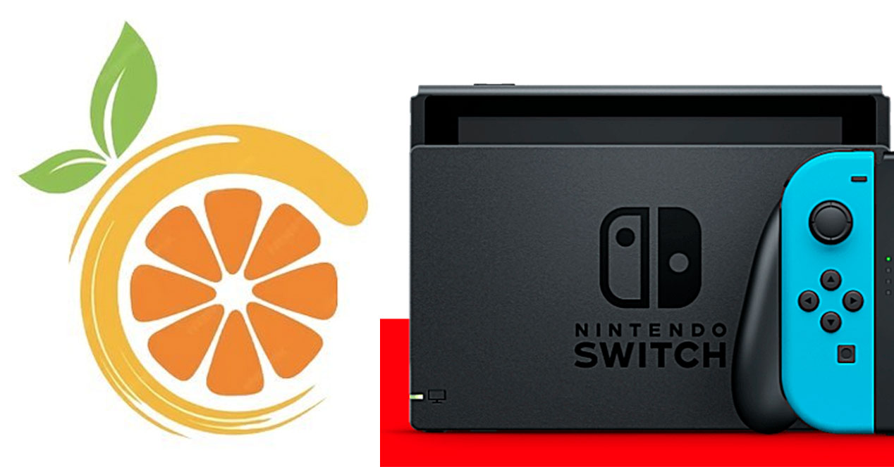

N<h1 align="center">Gaiiak Game Configuration tool for the Citron Switch emulator</h1>

  

  
Application Windows pour télécharger  et configurer l'émulateur Switch Citron.

  
  
  

<h2 align="center">Description</h2>

  
 🚀 Gaiiak Game's Citron Tools est une application Windows qui centralise l'installation, la configuration et la maintenance de l'&eacute;mulateur Switch Citron.

  <ul>
    <li>T&eacute;l&eacute;chargement de la derni&egrave;re version CI.</li>
    <li>T&eacute;l&eacute;chargement et installation d'un kit (firmware, param&egrave;tres).</li>
    <li>Gestion des profils et presets par jeu.</li>
    <li>S&eacute;lection des jeux avec visuels.</li>
    <li>Application de mods (textures HD, r&eacute;solution, ultrawide).</li>
    <li>Options r&eacute;seau en cours de d&eacute;veloppement.</li>
  </ul>
  
L'application n'est pas affili&eacute;e &agrave; l'&eacute;diteur de l'&eacute;mulateur Citron et, bien que gratuite, reste la propri&eacute;t&eacute; int&eacute;grale de Gaiiak Game (code et concept).

<h2 align="center">Tuto</h2>

  
Prochainement ...

<h2 align="center">Captures d'ecran</h2>

  <table style="width: 100%; max-width: 980px; margin: 0 auto;">
    <tr>
      <td style="width: 340px; vertical-align: top; padding: 8px;">
        
      </td>
      <td style="vertical-align: top; padding: 8px; text-align: left;">
        
<strong>Gestion des versions</strong> R&eacute;sum&eacute; &agrave; compl&eacute;ter.

        <a href="https://youtu.be/..." target="_blank">Lien YouTube</a>
      </td>
    </tr>
    <tr>
      <td style="width: 340px; vertical-align: top; padding: 8px;">
        
      </td>
      <td style="vertical-align: top; padding: 8px; text-align: left;">
        
<strong>Gestion des Profils de jeu & Presets</strong> R&eacute;sum&eacute; &agrave; compl&eacute;ter.

        <a href="https://youtu.be/..." target="_blank">Lien YouTube</a>
      </td>
    </tr>
    <tr>
      <td style="width: 340px; vertical-align: top; padding: 8px;">
        
      </td>
      <td style="vertical-align: top; padding: 8px; text-align: left;">
        
<strong>Description du jeu en multilangue</strong> R&eacute;sum&eacute; &agrave; compl&eacute;ter.

        <a href="https://youtu.be/..." target="_blank">Lien YouTube</a>
      </td>
    </tr>
    <tr>
      <td style="width: 340px; vertical-align: top; padding: 8px;">
        
      </td>
      <td style="vertical-align: top; padding: 8px; text-align: left;">
        
<strong>Gestion des mod</strong> R&eacute;sum&eacute; &agrave; compl&eacute;ter.

        <a href="https://youtu.be/..." target="_blank">Lien YouTube</a>
      </td>
    </tr>
    <tr>
      <td style="width: 340px; vertical-align: top; padding: 8px;">
        
      </td>
      <td style="vertical-align: top; padding: 8px; text-align: left;">
        
<strong>Personnalisation des interfaces</strong> R&eacute;sum&eacute; &agrave; compl&eacute;ter.

        <a href="https://youtu.be/..." target="_blank">Lien YouTube</a>
      </td>
    </tr>
    <tr>
      <td style="width: 340px; vertical-align: top; padding: 8px;">
        
      </td>
      <td style="vertical-align: top; padding: 8px; text-align: left;">
        
<strong>Lancement des jeux via les profils </strong> R&eacute;sum&eacute; &agrave; compl&eacute;ter.

        <a href="https://youtu.be/..." target="_blank">Lien YouTube</a>
      </td>
    </tr>
  </table>

<h2 align="center">Notes des mises a jour</h2>

 <ul>
  

  <li>V1.1 Ajout des profils et presets de configuration.     </li>
  <li>V1.2 Ajout fonctionnalités : les profils permettent de sélectionner le jeu à lancer avec l'émulateur.     </li>
  <li>V1.3 Ajout : la sélection du jeu renomme le profil à son nom et s'affiche la photo du jeu.      </li>
  <li>V1.4 Ajout du descriptif du jeu + Ajout des fonctionnalités de jeu en réseau.
      </li>
  <li>V1.5 Refonte de l'interface + ajout de la gestion des mod. </li>
  

